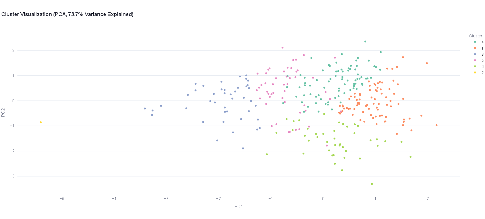

# Customer360AI 
**A powerful Streamlit app for automated EDA and customer segmentation**
## Table of Contents
- [Overview](#overview)
- [Features](#features)
- [Demo](#demo)
- [Getting Started](#getting-started)
- [Usage](#usage)
- [Modules](#modules)
- [Screenshots](#screenshots)
- [Author](#author)
## 🧾 Overview

**Customer360AI** is a powerful and interactive web-based tool for performing **Exploratory Data Analysis (EDA)** and **Customer Segmentation** — all in one place.

Whether you're a **data scientist**, **analyst**, **machine learning engineer**, or just someone working with data, this app lets you explore your datasets, generate insightful visualizations, and cluster customer groups with ease — all without writing code.

The app consists of two main modules:

- **EDA Generator** – Visualize univariate, bivariate, and multivariate relationships using smart plot recommendations and statistical summaries. Highly flexible and user-driven, allowing you to select and compare any features.
- **Segmentation Engine** – Apply KMeans clustering on cleaned, scaled, and encoded customer data with intuitive visualizations like Elbow Curve and PCA plots.

---

## Objective

-  **Save time** by eliminating the need to manually code EDA logic and charting
-  Empower users to **plot anything with any column(s)** using a clean UI
-  Help identify patterns, relationships, outliers, or segments from raw data
-  Useful for both beginners and experts — no coding required for basic use, but deeper insights (e.g., PCA) benefit from domain knowledge
-  Accessible via web — no installation needed

---

## Try It Live

👉 **[Click here to launch the app on Streamlit Cloud](https://automatic-eda-generator-dgdyjvavohgrjawnunorag.streamlit.app/)**

> Upload your own CSV data to start exploring immediately.
## Features

### EDA Generator (Main Module)

Explore and visualize your dataset from every angle with this flexible, intelligent EDA system.

#### Univariate Analysis
- Automatically detects column type and selects appropriate plot:
  - Histograms and box plots for numeric columns
  - Pie charts for low-cardinality categorical columns
  - Bar plots for high-cardinality categorical columns

#### Bivariate Analysis (3 Dedicated Tabs)
- **Categorical vs Target**: Count plots to explore classification targets
- **Numeric vs Target**: Select chart type (box, violin, swarm) to compare distributions across target classes
- **Target Analysis**: Pie/bar charts to visualize class balance; mean target value by category for feature relevance

#### Multivariate Analysis (5 Advanced Tabs)
- **Numeric vs Numeric**:
  - Multiple plot types: scatter, joint, correlation heatmap, hexbin
  - Optional: trendline, log scales, outlier highlighting, color scales
- **Categorical vs Categorical**:
  - Plots: stacked, clustered, mosaic
  - Includes chi-square test, contingency table, and normalization options
- **Numeric vs Categorical**:
  - Plot types: box, violin, strip, swarm with customization (alpha, hue, sample size)
- **Custom Relationships** (AI-guided):
  - Suggests best plots based on selected feature types
  - Fully customizable: hue, bins, filters, axis types, sampling
- **AI Advanced Analysis**:
  - PCA, UMAP, Missing Data Maps, Mutual Information, Feature Interaction Matrix, Correlation Variants

#### Advanced Insights
- **Executive Summary** with data composition, target analysis, data quality, and relationships
- **Business-Oriented Insights** with automatic recommendations
- **Full JSON Report** generated and auto-saved

#### Smart Plotting
- Intelligent plotting engine in *Custom Relationships* tab suggests ideal visualizations and custom parameters based on column types

#### Export & Downloads
- Multiple download buttons throughout the app (plots, tables, JSON reports)
- Streamlit-native plot download support

---

### Segmentation Engine (KMeans)

Cluster your customer data with ease using flexible options and insightful visualizations.

#### Preprocessing
- Handle missing values via:
  - Row dropping
  - Mean imputation (numerical), mode (categorical)
- Choose between **Label Encoding** and **One-Hot Encoding**

#### Scaling
- Support for **StandardScaler** and **MinMaxScaler**

#### Clustering
- Uses **KMeans** algorithm
- Automatically computes and displays:
  - **Silhouette Score**
  - **Elbow Curve**

#### Visualizations
- **PCA**-based 2D scatter plot for cluster visualization
- **Cluster Averages** and **Assignment Table**
- **Cluster Centers Plot**

#### Results Download
- Full clustered dataset downloadable as CSV
## Demo

👉 **[Launch the App](https://automatic-eda-generator-dgdyjvavohgrjawnunorag.streamlit.app/)** on Streamlit Cloud

> No setup required — just upload your CSV to start exploring immediately.

 Supports any CSV with numeric and categorical data  
 Offers automatic visualizations and insights based on your selection  
 KMeans-based segmentation is also available in a dedicated module

---
## 📸 Screenshots

### EDA Generator – Multivariate Analysis

### Segmentation Module – PCA Visualization

### Advanced Insights & Recommendations

>  You can add your own dataset and instantly generate these types of visualizations.
## Author

**Zeeshan Akram**  
Software Engineering Student | Data Science & Machine Learning Enthusiast  
Passionate about intelligent systems, EDA automation, and real-world predictive analytics.

- 🔗 [LinkedIn]([https://www.linkedin.com/in/your-profile/](https://www.linkedin.com/in/zeeshan-akram-572bbb34a/))  
- 💻 [GitHub]([https://github.com/yourusername](https://github.com/zeeshan-akram-ds))  
- ✉️ zeeshanakram1704@example.com  
